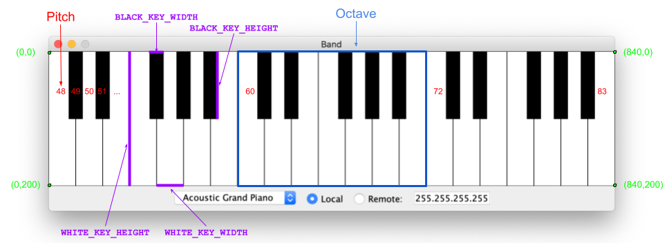

CS2103 2022 B-Term -- Project 1 -- Band

Prof. Jacob Whitehill

Introduction
============

In this project you will create a graphical piano keyboard on which the user can press the keys using the mouse to generate music from a variety of different musical instruments, such a piano, guitar, harpsichord, etc. The sound is generated using the Java MIDI (Musical Instrument Digital Interface) library, which takes care of a lot of tedious details of producing sound through the speaker for you. Moreover, when multiple instances of the program are run at the same time (from either the same or multiple computers), their sound outputs can be combined (using the provided "Server" program that you don't need to modify) to create an electronic "band". This project is an example of _event-driven programming_ whereby the control flow is not pre-defined, but rather is determined by the _user_ according to the mouse events (pressing, releasing, or dragging the mouse across the piano keys) that they generate. It also will provide an exercise in graphical user interfaces (GUIs) using the Java Swing library. Note that you do **not** need to have any prior knowledge of Swing or MIDI to do this project.

Description
===========

The image below shows what you will be building, along with some annotations of the precise geometry of the piano keyboard and the pitch that each key has.   
Also, here is a [demo video Links to an external site.](https://youtu.be/f9JRGPVUIDI)  of the Band program in action.

The image above gives an idea of what you are tasked to build: in contrast to a standard piano keyboard (which has 88 keys), you are only building a small version with 36 keys. As you can see, some of the keys are white and some are black. All of them are rendered as polygons, but their exact shape differs: The black keys are all rectangles of the same dimensions, whereas the white keys have slightly more complicated shapes that span 3 different varieties (two of which are equivalent to each other if you flip them left-to-right). The horizontal center of each black key coincides exactly with either the far-right or far-left edge of the two white keys it sits between.

Whenever the user presses the mouse button on a key of the "piano", a sound is generated of a particular pitch. The left-most key on the piano keyboard has the lowest pitch (48), and the right-most key has the highest pitch (83); all the keys in-between (both the white and black ones) have a pitch that ascends from left to right (see the red labels of 48, 49, 50, ...). The generated sound will case when the mouse button is either released or the mouse is dragged to a different key.

At a high level, your tasks in this project are two-fold: (1) Render (i.e., draw/paint) the keys on the keyboard, and update their appearance whenever they are pressed or released. (2) Handle the events (mouse presses, drags, and releases) to generate sound appropriately. Before describing these tasks in more detail, we first provide some background information.

Background
==========

Pianos
------

Although the program you are writing can produce sounds from many different musical instruments, the user interface used to "play" these instruments is always a piano. Real pianos typically have 88 keys, but in this project the piano will have only 36 keys. Keys on a piano can be grouped into multiple _octaves_, which is a contiguous sequence of keys (that also have other musical properties beyond the scope of this course). In particular, the figure above shows one particular octave containing 7 white keys and 5 black keys; the piano keyboard in this project consists of 3 such octaves in total. Hence, one way of decomposing the task of creating the keys is to write a helper method to create just one octave, and then just call it 3 different times.

Graphical User Interface (GUI) with Swing
-----------------------------------------

Swing is a powerful library for creating interactive (via the mouse and keyboard) graphical user interfaces (GUIs) such as the "piano" you will create in this project. (Note that Swing is actually an older library compared to JavaFX, but the latter is mired by annoying licensing and installation difficulties.) In this project, we will only be scratching the surface of what it can do. In particular, you will need to (1) use the java.awt.Polygon class to render the keys on the "piano" and test for whether a specific (x,y) coordinate is within its bounds; and (2) implement an "event handler" (the PianoMouseListener class) to respond to when the user presses, releases, or drags the mouse on the "piano". (Note that there's a small amount of tedious setup involved in "registering" an event handler, but these details are taken care of for you already by the starter code we provide.)

**Polygons**: Java provides a convenient java.awt.Polygon class, i.e., a class Polygon that sits inside the java.awt "package". (Java packages are just a way -- similar to the folder/directory hierarchy on your computer -- to organize the thousands of classes that Java provides off-the-shelf.) The constructor to Polygon takes three parameters:

1.  xCoords: the array of x-coordinates of the vertices in the polygon.
2.  yCoords: the array of y-coordinates of the vertices in the polygon.
3.  nPoints: the total number of vertices in the polygon.

Make sure that the _i_th element of xCoords corresponds to the _i_th element of yCoords, for each i=0, ..., (nPoints\-1). Moreover, make sure that the coordinates in these arrays describe the positions of the vertices in the polygon _in sequence as you trace along its perimeter_ -- it should not randomly "jump around" from one vertex to another. Aside from that, the order of the vertices does not matter. An example is provided in the Piano.makeKeys method of the starter code.  
The Polygon class also contains a handy method, contains(x, y), that tests whether the specified (x,y) coordinate is within the bounds of the polygon. An example of this is given in the PianoMouseListener.mousePressed method in the starter code.

**Drawing the keys**: With Swing, stuff gets rendered (aka painted) onto the screen by a method called paint(Graphics g). _When_ this method gets called is actually somewhat complicated, but fortunately you don't have to concern yourself with the details. Basically, the paint method gets called by Swing when the program first starts (so that the user doesn't just stare at an empty window), and when the user does something (e.g., press the mouse on a piano key) that requires something to be _repainted_. (If you look into the Key.play method, you'll see a method call to repaint (sent to the \_piano object) -- this sends a request to Swing to please repaint the piano, since one of its keys has likely changed state.)

Once you've properly instantiated the Key objects (and their associated Polygon objects), then all you have to do to draw the keys is implement the Key.paint(g) method. This method is called by the paint method of the Piano class. The starter code (Key.java) shows a simple example that always draws the key in black (Color.BLACK). You will need to modify this code so that the color changes depending on whether the key is pressed and whether the key is black or white. On the Graphics g object that paint receives as a parameter, you can use the setColor (changes the current color used to draw/fill), fillPolygon (fills the _interior_ of the polygon with color), and drawPolygon (draws the _outline_ of the polygon) methods to accomplish this.

**Handling events**: Swing makes it easy to handle user input events (e.g., from the keyboard and mouse). The usual way is to create an "event handler" class that contains certain methods such as onMousePressed, keyPressed, etc. Then, the event handler object needs to be "registered" with Swing. Once this is done, Swing will know to call the appropriate method on the appropriate event handler whenever that event occurs. (In this project, most of the tedious details of creating and registering the event handlers is done for you; you just need to handle the events correctly.) **Non-determinism**: One of the tricky things of this project and event handling in general is that, given a sequence of behaviors generated by the user, the sequence of events that is submitted to your event handler can differ depending on a variety of external factors over which your program has no control (e.g., how much load on the system is generated by _other_ programs). Consider the following scenario: The user presses the mouse at position (10,20). Then, they drag it quickly to (30,100). Finally, they release it. Given this event sequence, it is guaranteed that:

*   The event handler's onMousePressed(e) method will be called such that e.getX() equals 10 and e.getY() equals 20; and
*   The event handler's onMouseReleased(e) method will be called such that e.getX() equals 30 and e.getY() equals 100.

But what about the drag events? Will onMouseDragged(e) be called for _every_ integral value of (x,y) between (10,20) and (30,100)? Almost certainly not. Depending on how quickly the user moves the mouse, how much load on the CPU is placed by other programs, and various other factors, your event handler could receive _any number of events (**including 0**!) whose (x,y) coordinates lie on the actual path generated by the user_. Put into the context of the Band program, this means that, if the user pressed the mouse on one key, and then drags quickly to another position _several keys away_, then there is no guarantee that the mouse event handler will also receive drag events on the intermediate keys. Nevertheless, you must sure that your event handling code upholds proper behavior, e.g., at most one piano key is pressed at one time, all keys are turned off when the user releases the mouse, etc.

**Note: If you find yourself reading through lots of Swing documentation for help with this project, then you are probably on the wrong track.** Please contact (on Slack, Canvas, or email) a course staff-member (professor, TA, or SA) for help instead!

Sound Generation with the Java MIDI Library
-------------------------------------------

MIDI is a protocol for enabling computers to produce and record electronic music. Almost all of the tedium of working with the MIDI protocol has been done for you in the starter code we provide; all you have to do is (1) initialize each Key object with the correct pitch value (between 48 and 83, inclusive); and (2) call the play method of the Key class and pass it the correct value for isOn (which indicates whether the key is being turned on or off) at the right time. The play method will send a MIDI message to a "receiver". Depending on which receiver is being used, this can result in sound being played either on your local machine or (if you're using the "remote" mode) a remote music server. The sound that is produced will be made of the musical instrument that is currently selected (this is handled for you).

**Note: If you find yourself reading through lots of MIDI documentation for help with this project, then you are probably on the wrong track.** Please contact (on Slack, Canvas, or email) a course staff-member (professor, TA, or SA) instead!

Networking Multiple Instruments into a Band
-------------------------------------------

As a cute gimmick, this project allows you to play multiple instruments at the same time and send all their sound outputs to the same music "server". This functionality is completely handled for you by the ControlPanel, Band, and Server classes. You do not need to implement anything. In fact, you are not even required to run the server at all -- it's really just for fun. (With that in mind, I suggest you not trouble yourself with it until _after_ you're mostly done with the project.) If you want to try it, here's how:

1.  Choose a computer on which to run the server, and make note of its IP address. **Important note**: if your computer is connected to a home network with its own private subnet, then you will only be able to connect to the server from _other_ machines within the _same_ subnet.
2.  Compile and run the Server class on that computer.
3.  Now, on multiple different computers, run the Band program, and in the textbox beside the word "Remote:" at the bottom of the screen, replace the text "255.255.255.255" with the IP address that you noted above. Check the radio button beside "Remote:" to enable the remote transmission.
4.  You should now be able to play keys on all the Band computers and hear the sound produced by the server.

Requirements
============

Completing this project consists of implementing two main pieces of functionality:

Rendering the Piano Keyboard (20 points)
----------------------------------------

Implement the following methods:

*   void Piano.makeKeys()
*   void Key.paint(Graphics g)

The former method should instantiate, and add to the \_keys array in the Piano class, all of the 36 keys as shown in the figure above. This consists of two main steps: (1) creating a Polygon with vertices placed at the correct locations; and (2) determining the correct pitch for each key. The pitch of the left-most key should be START\_PITCH (which happens to be 48, as shown in the figure above). **Make sure that you write this method so that the keys adhere to the specification shown in the figure above.** In particular, the 36 keys should fit **exactly** into the rectangular window (if you work out the dimensions, it ends up being 840 pixels wide and 200 pixels tall) **without any gaps between keys**. The latter method should use _only_ the methods setColor, fillPolygon, and drawPolygon (of the Graphics g object passed as a parameter) to render each key. The key should be rendered according to its associated polygon, whether it is currently pressed down, and its color: Black keys should be rendered as Color.BLACK when not pressed and Color.GRAY when pressed; White keys should be rendered as Color.WHITE when not pressed and Color.GRAY when pressed.

Handling Mouse Events (15 points)
---------------------------------

Implement the following methods:

*   void PianoMouseListener.mousePressed(MouseEvent e)
*   void PianoMouseListener.mouseReleased(MouseEvent e)
*   void PianoMouseListener.mouseDragged(MouseEvent e)

These three methods are called by Swing when the user presses the mouse down, release it, or drags it (i.e., moved while the mouse button is pressed down) around, respectively. The parameter MouseEvent e contains the x,y location (obtained by e.getX() and e.getY(), respectively) of _where_ the mouse event occurred. (The e object also contains other data, but you won't need it.) Based on the x,y location of the event, and using the contains method that can be called on any object of type Polygon, you can deduce _which key_ received the event (see the pre-written code in mousePressed for an example). Your job is to figure out how to write these three methods so that, in cooperation with each other, they achieve the behavior shown in the video example. Make sure that your code upholds the following **invariants** (i.e., condition that is always true):

*   Every key that is turned on must eventually be turned off.
*   At most one key is ever turned on at any given moment in time; and
*   Whenever a key receives a mouseDragged or mousePressed event from Swing within its polygon, the key gets turned on.
*   You do not turn on a key that is already in the "on" state (i.e., pressed down), and you do not turn off a key that is already in the "off" state.

Unit tests (**10 points**)
--------------------------

In this project you will use the junit framework to help you ensure your program's correctness. With junit, you can write a set of _unit tests_ to test various pieces of functionality of your program. For instance, in one unit test you might verify that, when the user presses the mouse on the upper-left-most pixel of the piano keyboard, the key with the lowest pitch (48, i.e., START\_PITCH in Piano.java) is pressed.

Testing GUI code that handles user input is often more difficult than non-interactive programs. It is thus tempting to resort to manual testing, but this is tedious and harder to reproduce than automatic testing. To automate the testing process, you will make use of a method called makeMouseEvent (implemented for you in the PianoTester class contained in the starter code), as well as a fake MIDI "receiver" (called TestReceiver) that doesn't produce any actual sound but counts the number of times that a key with a certain pitch has been turned on or off. Together, this method and this receiver class enable you to run fully automatic tests that _simulate_ interacting with the piano using the mouse, but do not require manual mouse interaction and will not wake up your roommates through the computer speaker.

To get a sense of how this works, look at the testClickUpperLeftMostPixel method of PianoTester.java. This unit test checks that, when the user presses the mouse at location (0,1) (i.e., almost the upper-left-most position of the piano -- see figure above), the piano turns on the key with the pitch Piano.START\_PITCH (a constant whose value is 48). The makeMouseEvent method takes just two parameters: the x and y coordinates of where the event occurred. You can then "send" this mouse event to any of the event handler methods in the PianoMouseListener class: mousePressed, mousePressed, or mousePressed. Before and/or after doing so, you can call methods on the TestReceiver object (an instance to it is saved in the \_receiver variable of PianoTester) to check whether a particular key is on/off (isKeyOn(pitch)), and count how _many_ times a particular key has been turned on or off (getKeyOnCount(pitch), getKeyOffCount(pitch)). Together, these methods will allow you to test most (though probably not all) of the functionality of the Band program.

Make sure you implement **at least 3** unit tests beyond the ones that are already defined in PianoTester.java, **and** that you finish implementing the testDragWithinKey unit test that was started for you. Note that each unit test can contain multiple assert... methods!; hence, each unit test method should be substantial in its scope. All in all, your unit test methods should at least do the following:

*   Test that keys turn on and off correctly according to mouse press, drag, and release events -- test this not just for one specific key, but _several_ keys (at least 2 different black keys, and at least 2 different white keys). (In fact, if you want, you can use a loop to test that it works for _all_ the keys, but this is not required.)
*   Test that the polygon boundary for several keys (all 3 kinds of white keys, and at least 1 black key) is set exactly correctly according to the geometric guidelines above.

Program Design (**10 points**)
------------------------------

In addition to the correct behavior of your program, your project will also be evaluated by the design of your code:

**Eliminating code redundancy**: There is a lot of potential code redundancy in this project, especially in the rendering of the keys on the simulated keyboard. Whenever possible, it should "factored out" into common helper methods (possibly with a parameter that specifies some nuance of behavior if the functionality is not quite _exactly_ the same).

**Simple logic**: In most programming tasks, there are more and less complicated ways of achieving the same correct behavior. Simpler designs are less prone to have bugs and are more easily understood by other coders; they are also often the most computationally efficient solutions. Aim for simplicity.

**Consistent code style**: See the style guidelines provided in lecture during the first week of class.

**Helpful commenting**: Each method that you add should be preceded by a comment that clearly describes what it does, what parameters it takes, and what it returns. (Note: Javadoc style is not required for this assignment.) Moreover, "non-obvious" parts of the method should have a 1-line comment giving a "hint" to a new programmer who might read your code about what it does or how it does it.

Teamwork
========

You may work as a team (up to 2 people) on this project. **If you work as a team, make sure you are registered as a team for Project 1 on Canvas. Note that you must do this separately for _each_ project, as teams can change over the term.** Upon submitting the project, you will be asked to submit a simple self-evaluation of whether your contribution to the project was much less, roughly equal, or much more, compared to the other people on your team; the responses may be used to adjust grades.

Getting started
===============

1.  Watch the [walk-through video Links to an external site.](https://www.youtube.com/watch?v=9HuFNQIfqhY&feature=youtu.be).
2.  Setup an Eclipse (or whatever other IDE you choose) environment, including the junit 5.9.1 library. See [this walk-through Links to an external site.](https://docs.google.com/presentation/d/1tXRR61BoxeCUf_pkgIrR9R5Wwyb8sqmWctjKDnDw9xU/edit#slide=id.p) of how to install Eclipse, load the starter code, and submit your zipped assignment. Also see the course Canvas page on [Software](https://canvas.wpi.edu/courses/39079/pages/software "Software") for more information.
3.  Download the starter code Project1.zip from the Files section of the course Canvas site.
4.  Compile and run the Band.java file from the starter code, and see what it does. Then, read through the code (focus on Key.java, Piano.java, and PianoMouseListener.java -- don't worry too much about the other files) and try to understand _how_ the starter code does what it does. Do **not** concern yourself with all the method calls to the MIDI and Swing libraries. Rather, focus on the methods: makeKeys, paint (in both the Piano and Key classes), mousePressed, and play methods. Also, note that the testClickUpperLeftMostPixel test case in PianoTester will fail until you implement the piano keyboard correctly.
5.  Watch the [demo video Links to an external site.](https://youtu.be/f9JRGPVUIDI)  , and try to understand _exactly_ what should happen -- in turns of turning keys on and off -- when the user presses, drags, and/or releases the mouse button.
6.  Examine the piano figure above and make sure you understand _exactly_ what the positions and shapes of all the keys should be like. How are the white keys' shapes similar to each other?
7.  Given your understanding of how events should be handled and how the keys should be drawn, design and implement some specific test cases in the PianoTester class.
8.  Implement the makeKeys method of the Piano class. Get this exactly correct before moving on to event handling.
9.  Implement the event handling in the PianoMouseListener class.

What to Submit
==============

You should create a Zip file containing all of the .java files (no class files!) that you modified. (Files in the Project1.zip that you did not modify do not need to be submitted; however, it's ok if you do.) This includes at least: Piano.java, PianoMouseListener.java, Key.java, and PianoTester.java. If you create any external helper classes (not required, but permitted, in this project), then make sure you submit these as well! Above all: **Make sure that your Zip file contains all the .java files necessary to compile and run your code**.

(**Important note**: The file must be a Zip file, **not** a gz, rar, or 7z file! Submission of other file types may result in lost points.) Submit the Zip file you created to Canvas.
