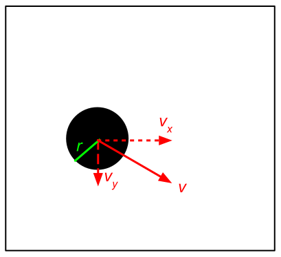
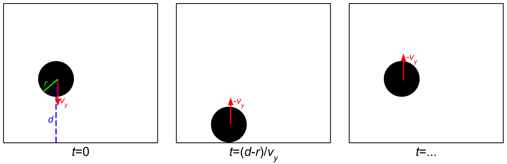
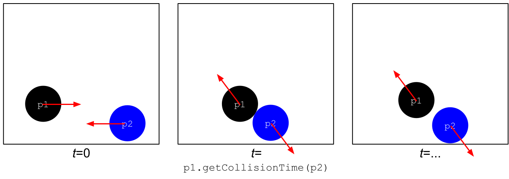
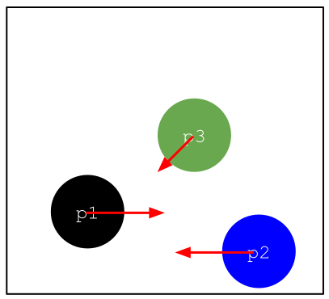

CS2103 2022 B-Term -- Project 3 -- Particle Simulator

Prof. Jacob Whitehill

Introduction
============

In this project you will build an event-driven simulator to simulate moving and colliding particles. To facilitate this, you will also implement a heap to serve as a priority queue. Event-driven simulations arise frequently in natural sciences, engineering, as well as computer games. Below is a movie illustrating what you will build by the end of the project.

Heaps and Priority Queues
=========================

A **priority queue** is a linear data structure that makes it easy to find the "highest priority" item and remove it from the queue. Priority queues are typically built as a **heap**, which is a tree-based data structure that offers fast -- _O_(log _n_)) time -- access to the largest element contained within it (removeFirst), as well as logarithmic time (_O_(log _n_)) for the add operation. (Note: _finding_ the largest element in a heap can be achieved in O(1) time, but removing it is _O_(log _n_).) In this assignment you will implement your own heap (in particular, you must implement a class HeapImpl that implements the Heap interface) whose underlying data are stored in an ordinary Java array (similarly to ArrayList).

The design and implementation of heaps will be discussed in class.

Comparable
----------

By definition, the items in the heap must be compared to each other to determine which one is larger. To support this operation, and to guarantee that every item in the heap can be compared with every other item in the heap, we will use something called a **type bound** on the generic type parameter. In particular we impose the following restrictions on the type T of data that can be stored in our heap: T extends Comparable<? super T>  
While we will not go into the details of what the type bound means in this course, the gist is that (a) every item that we store into the heap must implement the Comparable interface; in practice, this means that it must implement a method called compareTo; and (b) each such item must be able to be compared with _any_ object of type T (and in particular, no compareTo method can assume that the object to compare with is some _sub_\-class of T). In this assignment you do not have to worry too much about this type bound.

Simulation
==========

Particles
---------

In the simulation you will build, all particles have the same radius and mass. The "room" in which the particles live is a square, whose width is a parameter to the simulation. The radius of all the particles, as well as the lifetime of the simulation, are also specified by parameters.

Every particle has an initial position and velocity at the start of the simulation. The position and velocity values are read into the simulator from a file. We have included a few such simulation files in the starter code as examples. The figure below shows a single particle (with radius _r_) in the simulation room. Each particle also has a velocity which is shown below with the vector _v_. In this two dimensional particle simulation, we can represent _v_ with two components: _vx_ and _vy_, which are the velocities in the x and y directions, respectively. Note that in the Java swing graphics environment we are using, the x-axis increases as we move to the right, but the y-axis increases as we move down. Make sure you take this into account when determining collisions with walls (see below).  

Collisions
----------

### Particle-Wall Collision

The simplest kind of collision is when a particle collides with a wall. In the example below, the particle's velocity is such that vx equals zero and is therefore not shown, and vy equals some positive number; therefore the particle is moving towards the bottom wall. Based on how far the center of the particle is from the wall, the particle's radius, and the particles velocity in a certain direction, we can calculate when the collision with each wall will occur. Collisions with the top and bottom walls should cause the particle's vertical velocity vy to be multiplied by -1. Collisions with the left and right walls should cause the particle's horizontal velocity vx to be multiplied by -1. It is up to you to calculate the wall collision times and to implement the velocity changes for these collisions yourself.  

### Particle-Particle Collision

Next let's consider the more complicated case where two particles can collide with each other. In the figure below, the two particles, p1 and p2, are moving toward each other, but they will not impact with each other head-on. Instead, their collision is oblique, which causes their velocities after the collision to change in direction. To calculate the time when two particles with given positions and velocities will collide with each other, and also to calculate what their velocities after the collision will be, we need to use some physics. Since the focus of the assignment is obviously on the programming rather than physics, we have implemented the physics calculations for you in the starter code. In particular, you can call a method called getCollisionTime which is implemented in the Particle class to determine when a collision between two particles will occur. If the collision will never occur because the two particles trajectories do not intersect each other, then this method will return infinity. (In the latter case, you don't need to add the event to the event queue at all.) Also, to compute the velocities of the particles after the collision, you can call the method updateAfterCollision.  

Now consider the example below where we have added a third particle p3 (shown in green below). When generating events for p1, we must consider the possible collision p1 has with p2 as well as the possible collision of p1 has with p3. (Note: we must of course also generate events for particles p2 and p3.) In this new example, p1 will collide with p3 before p1 has a chance to collide with p2. We must therefore make sure that in our simulation the collision between p1 and p2 never happens. The right way to do this is _not_ to try to create some special logic where we "peek" into the future about what possible collisions could happen. Instead, all we have to do is enter _all_ possible collisions with their associated event times into the priority queue. We will process the events in the priority queue one by one according to their event times. Whenever an event at time _t_ is processed for some particle, then that particle's velocity has changed. As a result, there may be Events in the queue involving that particle that are no longer valid. We must thus _invalidate_ all future events for that particle that we had computed _before_ time _t_. To do this, we need to maintain a variable in each particle that indicates the last time that the particle was updated. Before processing an event in the queue, we first compare the time when that event was created to the involved particle(s)' last-update-times: If the event is out-of-date relative to the particle(s)' last-update-time, then we simply ignore the event.

Note also that, for the example below with three particles, you might be tempted to implement some special logic whereby you check the collision time for p1 and p3; compare it to the collision time for p1 and p2; conclude that the former collision would happen first; and therefore never add the latter collision to the queue. This approach is wrong: Suppose there were a fourth particle p4 (not shown in the figure) that would collide with p3 -- such a collision could potentially invalidate the collision between p1 and p3 and therefore p1 and p2 might collide with each other after all. The _right_ approach to this assignment is to enqueue all possible collisions for a given particle, and then let the event handling process and the priority queue take care of figuring out which collisions actually occur.  

Event Handling
--------------

Over the lifetime of the simulation, the particles will move according to their velocities and collide with other particles or perhaps the walls of the simulator. At the start of the simulation (see the simulate method in ParticleSimulator.java), you should iterate through all the particles; for each particle, you should determine the set of all collisions (either with other particles or the walls) in which that particle may be involved. For instance, if the start of the simulation is the scenario shown in the figure above with three particles (p1, p2, p3), then the event queue might look something like the following. (Note that the table below shows only the _contents_ of the queue, _not_ how the queue's data are structured internally in terms of a tree-based heap. Also, the times are just made up but are hopefully somewhat plausible.)

Event(p1, p2, time=6.10)

Event(p1, p3, time=5.23)

Event(p1, RightWall, time=14.90)

Event(p2, LeftWall, time=15.33)

Event(p2, p3, time=9.95)

Event(p2, p1, time=6.10)

Event(p3, BottomWall, time=6.78)

Event(p3, p1, time=5.23)

Event(p3, p2, time=9.95)

Event(p3, LeftWall, time=9.78)

Note that, at this stage, you do not need to determine which collision will actually happen first. In fact, as described above, it will happen frequently that, because of one collision, other collisions that were computed earlier will not actually take place. Which collisions actually happen and which do not will be determined implicitly by the priority queue and the event-handling logic you implement.

After adding the initial set of possible collisions to the event queue, you now must start processing the queue until the end of the simulation. This processing is conducted in the while-loop inside the simulate method. At the start of each iteration of the while-loop, you should extract the next event from the queue. You must then immediately check whether this event is still valid. The reason is that it is possible that this event is no longer relevant since the particle (or particles) in question may have been impacted by other events that occurred. Determining whether an event is still valid requires that you implement a bit of logic by comparing the time when the particle(s) was/were last updated and the time when the event itself was created. Assuming that the event is still valid you should update the positions of all the particles in the simulator based on the event's time. Then you must update the velocity or velocity of the relevant particle or particles in the collision.

Finally, besides processing the events in the queue, you must also render the particles' positions on the screen every time a valid event takes place. Most of the drawing methods has been implemented for you, but you must call them at the right times.

Code Design
-----------

As mentioned above, both particles and walls can take part in collisions. However, particles and walls are different kind of objects. One of the design challenges of the assignment is therefore to write your code that factors out the common collision logic but still respects these different objects' varying properties (particles move, but walls do not; particles are spheres, but walls are not). Various solutions are possible.

Requirements
============

1.  **R1** (25 points): Implement the Heap interface in the HeapImpl class. We will use automatic tests to grade your heap. Hence, make sure that you do not modify the Heap interface in any way, and that your HeapImpl correctly implements the Heap interface.
2.  **R2** (35 points): Implement the event-driven particle simulator using the HeapImpl from R1 to keep track of events. We will use automatic tests to grade whether your program can correctly simulate a variety of different starting configurations (positions and velocities) of particles. For this reason, please make sure that your submitted program only prints the following data:
    
                    // Print out the final state of the simulation  
                    System.out.println(\_width);  
                    System.out.println(\_duration);  
                    for (Particle p : \_particles) {  
                            System.out.println(p);  
                    }
    
    These lines of code appear at the end of the simulate() method in ParticleSimulator.java in the starter code.
    

Coding Style
============

Your code must adhere to reasonable Java style. In particular, please adhere to the following guidelines:

*   Class names should be in CamelCase; variables should be in mixedCase.
*   Avoid "magic numbers" in your code (e.g., for (int i = 0; i < 999 /\*magic number\*/; i++)). Instead, use **constants**, e.g., private static final int NUM\_ELEPHANTS\_IN\_THE\_ROOM = 999;, defined at the top of your class file.
*   Use whitespace consistently.
*   No method should exceed 50 lines of code (for a "reasonable" maximum line length, e.g., 100 characters). If your method is larger than that, it's probably a sign it should be decomposed into a few helper methods.
*   Use comments to explain non-trivial aspects of code.
*   Use the **most restrictive** access modifiers (e.g., private, default, protected\>, public), for both variables and methods, that you can. Note that this does not mean you can never use non-private access; it just means you should have a good reason for doing so.
*   Declare variables using the **weakest type** (e.g., an interface rather than a specific class implementation) you can; ithen instantiate new objects according to the actual class you need. This will help to ensure **maximum flexibility** of your code. For example, instead of  
    ArrayList<String> list = new ArrayList();  
    use  
    List<String> list = new ArrayList<String>();  
    If, on the other hand, you have a good reason for using the actual type of the object you instantiate (e.g., you need to access specific methods of ArrayList that are not part of the List interface), then it's fine to declare the variable with a stronger type.

Teamwork
========

You may work as a team on this project; the maximum team size is 2.

Starter Code & Simulations
==========================

The starter code can be downloaded from Canvas in the Project3.zip file. This Zip file contains both some .java files as well as a few simple simulations. Two of the included simulations have both a start and an end text file. The former contains the positions and velocities of some particles at the start of a simulation, whereas the latter contains the positions and velocities of where the particles should end up at the end of the simulation. The file particlesInitial.txt is a simulation you should run (once your project is complete) and visualize after it finishes. Finally, there is a HeapTester.java to help verify the correctness of your heap implementation.

Simulation File Format
----------------------

1.  The very first number of the file is the width of the simulation room.
2.  The second number is the length in seconds of the simulation.
3.  The rest of the lines in the file consists of all the particles (name,x,y,vx,vy,radius) in the simulation.

What to Submit
==============

Create a Zip file containing all, and only, the \*.java files needed to implement your simulator. Submit the Zip file you created to Canvas.
