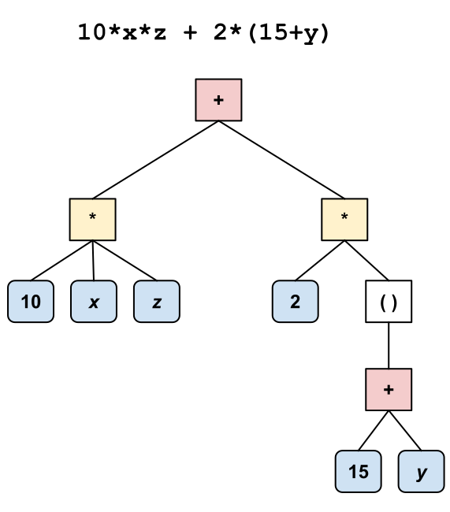

CS2103 2022 B-Term -- Project 4 -- Graphing Calculator

Prof. Jacob Whitehill  
  
In this project you will build a graphing calculator that receives as input a string that expresses a univariate mathematical function (in _x_) and produces the corresponding 2-d graph (an example is shown in the image above in the red curve). Moreover, the calculator can perform symbolic differentiation to find the derivative of the function and plot it as well (shown as the yellow curve). To this end, you will need to **parse** a string from the user into a tree representation, and then **evaluate** the tree after substituting specific values for the dependent variable _x_. Moreover, you will need to **convert** one expression tree into another by following the rules of differentiation.

Parsing Mathematical Expressions
================================

You will need to build a **recursive descent parser**, based on a **context-free grammar** (CFG), to convert a string -- e.g., 10\*x^3 + 2\*(15+x) -- into a **parse tree** that captures the expression's mathematical meaning, e.g.:  
  
In the figure above, each blue node is a "literal" that represents af floating-point number; each green node is a variable; and each clear node represents a mathematical operation such as addition, multiplication, exponentiation, etc. Obviously, these nodes are arranged into a _tree_.

Expression interface
--------------------

This assignment will require multiple classes (e.g., MultiplicativeExpression, AdditiveExpression, LogarithmicExpression) that represent different kinds of mathematical expressions. Every expression has some methods that must be supported, however. Accordingly, we have defined an Expression interface. Four methods that every Expression must support are convertToString, evaluate, deepCopy, and differentiate.

CFG for Mathematical Expressions
--------------------------------

There are many possible grammars you could use to complete this project. One suggestion is the following:

*   S → S+M | S-M | M
*   M → M\*E | M/E | E
*   E → P^E | P | log P
*   P → (S) | L | V
*   L → <float>
*   V → x

The names given to the non-terminals do not affect the parser but help us to understand their function, e.g., S for _sum_ (or, conveniently, for _start_, since it's the starting non-terminal symbol of the grammar), M for _multiplication_, E for _exponentiation_, P for _parentheses_, L for _literal_, and V for _variable_. The "multiplication" non-terminal can actually handle both multiplication itself as well as its inverse (division), and the same also applies to the "addition" and "exponential" non-terminals. The <float> means _any valid floating point number_ (the starter code we give you will take care of this for you, since it's tedious).  
(Note: the grammar above does not lend itself to a particularly efficient parser, but it is arguably easier to understand than other grammars that could also work.)

Based on this CFG, you can implement a recursive descent parser, in a similar manner as described in class. However, in contrast to the example in class in which each "parse" method returned a boolean, your parse methods should return an object of type Expression (an interface type described below). Each parse method should either return an Expression object representing the sub-tree for the string that you are parsing, or null if the string passed to the parse method cannot be parsed.

In this assignment, you should create a class called SimpleExpressionParser that implements the ExpressionParser interface.

Evaluating Mathematical Expressions
===================================

Given the parse tree you created, you must also implement a method called evaluate that computes the _value_ of the expression given the value of the dependent variable _x_. Examples:

*   (1/x) - (x^2 + 1) given x=2 evaluates to \-4.5.
*   2.5\*x^3 given x=-1 evaluates to \-2.5.
*   2^x given x=4 evaluates to 16.
*   x given x=3 evaluates to 3.
*   6 given _any_ value of x evaluates to 6 since the expression does not depend on _x_.

The evaluate method is used by the graphing calculator to plot the graph by passing in many different values for _x_ (over the domain \[-10,+10\]). There should be an implementation of evaluate for every different mathematical operation that you parse (subtraction, exponentiation, etc.). The evaluate method in each expression should recursively evaluate each of its child expressions (if it has any), and then combine them using the appropriate operation (addition, multiplication, etc.).

Converting an expression to a string
------------------------------------

In order to help us (during grading) to verify that your parser is working correctly, you need to implement a convertToString method (see the Expression interface). This method should print out the contents of the entire expression tree, using one line per node of the tree, such that each child node is indented (using \\t) one more time than its parent. For example, if we parse the string "10\*x + 2\*(15+x^3)":

ExpressionParser parser = new SimpleExpressionParser();
Expression expression = parser.parse("10\*x - 2\*(15+x^3)");

and then we call expression.convertToString(0), then the result should be:

\-
	\*
		10.0
		x
	\*
		2.0
		()
			+
				15.0
				^
					x
					3.0

In the output above, the \- in the first line signifies that the root expression performs subtraction. Its two children both perform multiplication (signified by \*). The first such multiplication itself has _three_ children, namely 10, x, and x, and so on. The ^ symbol signifies exponentiation. For logarithmic expressions, use log to note the expression. Note that, even though the input text itself might consist of just integers, the convertToString will need to print these numbers out as floats (which is why they have a decimal point in the output above).

Symbolic Differentiation
------------------------

In the Expression interface there is a method called differentiate that takes no parameters and returns an object of type Expression. Recall some of the rules of differentiation from calculus:

*   If function _f_ is the sum of two functions _g_ and _h_, then the derivative of _f_ is the sum of the derivative of _g_ and the derivative of _h_. In other words, if _f_(_x_)=_g_(_x_) + _h_(_x_), then its derivative is _f_'(_x_)=_g_'(_x_) + _h_'(_x_).
*   If function _f_(_x_)=_g_(_x_) - _h_(_x_), then its derivative is _f_'(_x_)=_g_'(_x_) - _h_'(_x_).
*   If function _f_(_x_)=_g_(_x_)_h_(_x_) (i.e., the product of _g_(_x_) and _h_(_x_)), then its derivative is _f_'(_x_)=_g_(_x_)_h_'(_x_) + _g_'(_x_)_h_(_x_).
*   If function _f_(_x_)=_g_(_x_)/_h_(_x_), then its derivative is _f_'(_x_)=_g_'(_x_)/_h_(_x_) - _g_(_x_)_h_'(_x_)/_h_(_x_)2.
*   If function _f_(_x_)=_C__h_(_x_) (where _C_ is a positive constant), then its derivative is _f_'(_x_)=(log _C_) _C__h_(_x_) _h_'(_x_), where log is the natural logarithm function.
*   If function _f_(_x_)=_g_(_x_)_C_ (where _C_ is a constant), then its derivative is _f_'(_x_)=_C_ _g_(_x_)_C-1_ _g_'(_x_).
*   If function _f_(_x_)=log _g_(_x_), then its derivative is _f_'(_x_)=_g_'(_x_)/_g_(_x_)

You must implement all of the differentiation rules above. An example is shown below that illustrates an expression tree for a function _f_ and a possible expression tree that results after performing symbolic differentiation to obtain _f_'. Note that you do **not** have to simplify the resulting tree -- it is fine to leave it in its most expanded form.  

Note that you do _not_ have to handle the case where _f_(_x_)=_g_(_x_)_h_(_x_); instead, you can simply throw an UnsupportedOperationException from the differentiate method if that case is encountered.

**Deep copy**: In the rules above, derivative _f_' may involve some of the same terms as the function _f_ itself. For instance, in the third rule above (i.e., for multiplication), the function _g_ shows up both in the definition of _f_ (i.e., _f_(_x_)=_**g**_(_x_)_h_(_x_)) and in the definition of _f_' (i.e., _f_'(_x_)=_**g**_(_x_)_h_'(_x_) + _g_'(_x_)_h_(_x_)). **Make sure that, when creating the expression tree for the derivative function, you perform a _deep copy_ of the node in _f_'s expression tree** using the deepCopy method in Expression. (Otherwise, the expression tree of the function and its derivative would be "tied" together because they would share some of the same nodes. In a larger application in which all the different functions and their derivatives should be independently editable, this would cause problems.)

Object-Oriented Design
----------------------

This assignment offers ample opportunity to factor out common functionality using helper methods and helper classes; you should do so. For instance, if you create AdditiveExpression and SubtractiveExpression classes, these will be almost the same, except that they differ in which operator (+ or -) they use. Also, you should make LiteralExpression and VariableExpression classes that are childless, and other expression classes that can take children. The latter might all inherit from some kind of AbstractCompoundExpression superclass. **Note**: You are allowed to _add_ methods to the interfaces we give you, but you may not change or remove any! The exact design is up to you, but when we grade your submission we will take into account (a) the degree to which you eliminated redundancy, and (b) the intuitiveness of the class and interface hierarchy you used in your implementation.

Requirements
============

1.  Parsing and Expression Construction (35 points): Build a parser to convert a String into an Expression. Your parser must be able to handle the operations of addition, subtraction, multiplication, division, exponentiation, and logarithm. It must also be able to handle **arbitrarily deeply nested balanced parentheses** (e.g., ((2+(((x)))+3))). You **must** use a CFG to construct your parser -- do not try to "hack" something together through other means.
2.  Evaluation (10 points): Implement the evaluate method of every class that implements the Expression interface.
3.  Differentiation (15 points): Implement the differentiate method of every class that implements the Expression interface.
4.  Panning & Zooming (6 points **extra credit**): Allow the plotting window to be arbitrarily **zoomed** & **panned** using the mouse (e.g., clicking and/or dragging) so that the user can "navigate" to different parts of the function's domain. The exact user interface is up to you as long as it provides these features and is reasonably intuitive. It's up to you to figure out how to use JavaFX to make this happen.

Design and Style
================

Your code must adhere to reasonable Java style. In particular, please adhere to the following guidelines:

*   **Factor out** the logic that is common to the various Expression classes.
*   Each class name should be a singular noun that can be easily pluralized.
*   Class names should be in CamelCase; variables should be in mixedCase.
*   Avoid "magic numbers" in your code (e.g., for (int i = 0; i < 999 /\*magic number\*/; i++)). Instead, use **constants**, e.g., private static final int NUM\_ELEPHANTS\_IN\_THE\_ROOM = 999;, defined at the top of your class file.
*   Use whitespace consistently.
*   No method should exceed 50 lines of code (for a "reasonable" maximum line length, e.g., 100 characters). If your method is larger than that, it's probably a sign it should be decomposed into a few helper methods.
*   Use comments to explain non-trivial aspects of code.
*   Use a [Javadoc Links to an external site.](http://www.oracle.com/technetwork/articles/java/index-137868.html) comment to explain what each method does, what parameters it takes, and what it returns. Use the /\*\*...\*/ syntax along with @param and @return tags, as appropriate.
*   Use the **most restrictive** access modifiers (e.g., private, default, protected\>, public), for both variables and methods, that you can. Note that this does not mean you can never use non-private access; it just means you should have a good reason for doing so.
*   Declare variables using the **weakest type** (e.g., an interface rather than a specific class implementation) you can; ithen instantiate new objects according to the actual class you need. This will help to ensure **maximum flexibility** of your code. For example, instead of  
    ArrayList<String> list = new ArrayList();  
    use  
    List<String> list = new ArrayList<String>();  
    If, on the other hand, you have a good reason for using the actual type of the object you instantiate (e.g., you need to access specific methods of ArrayList that are not part of the List interface), then it's fine to declare the variable with a stronger type.

Teamwork
========

You may work as a team on this project; the maximum team size is 2.

Getting started
===============

1.  Please download the Project4.zip starter file from Canvas. Note that this code requires JavaFX to run.
2.  Have a look at the ExpressionParserTester.java file, which includes some -- but not all -- of the test cases with which we will test your expression parser.
3.  Implement a hierarchy of classes and/or interfaces to implement the SimpleExpressionParser interface.
4.  After fully implementing SimpleExpressionParser, you can run the included GraphingCalculator GUI program and verify that expressions are getting parsed correctly.
5.  After implementing evaluate correctly, you should be able to plot the function correctly.
6.  After implementing differentiate correctly, you should be able to plot the derivative correctly.

How, What, and When to Submit
=============================

*   Create a Zip file containing all your Java files.